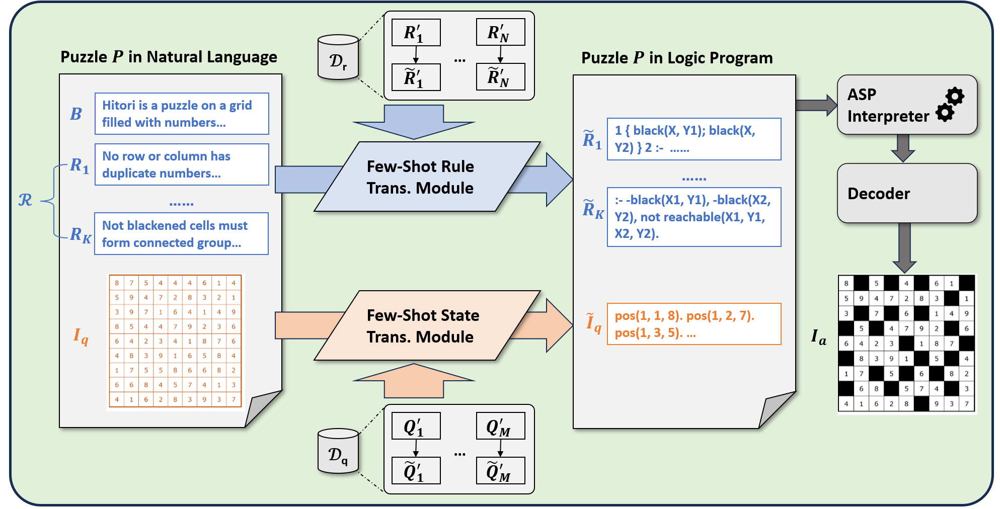

# Logic-of-Thought (Logot)


<p>
    <a href="https://www.python.org/">
        
    </a>
    <a href="https://copyright.princeton.edu/policy">
        
    </a>
</p>

Official implementation of "Logic-of-Thought: Empowering Large Language Models with Logic Programs for Solving Puzzles in Natural Language"




Solving puzzles in natural language poses a long-standing challenge in AI. While large language models (LLMs) have recently shown impressive capabilities in a variety of tasks, they continue to struggle with complex puzzles that demand precise reasoning and exhaustive search. In this paper, we propose Logic-of-Thought (Logot), a novel framework that bridges LLMs with logic programming to address this problem. Our method leverages LLMs to translate puzzle rules and states into answer set programs (ASPs), the solution of which are then accurately and efficiently inferred by an ASP interpreter. 
This hybrid approach combines the natural language understanding of LLMs with the precise reasoning capabilities of logic programs. 
We evaluate our method on various grid puzzles and dynamic puzzles involving actions, demonstrating near-perfect accuracy across all tasks.

## Requirements

We use Clingo as the ASP solver. The simplest way to install it is via pip:

```bash
pip install clingo
```

If problems occur, please see [here](https://potassco.org/clingo/) for details.

The code is tested with Python 3.9. Install required packages with:

```bash
pip install -r requirements.txt
```

## Quick Start

1. Experiment with a single puzzle
	- Demos of solving individual puzzles are available at ``./src/demo_{puzzle}.ipynb``.
	- Please provide your API key in the first block of the notebook.

2. Experiments of the paper
    - The scripts for reproducing our experiments are available at ``run.sh``.
	- Please provide your API key at the beginning of the script.

## Code Structure

- ``./src/logot/data/{puzzle}/``: Puzzle data.
- ``./src/logot/prompts/{puzzle}.py``: Various prompts for each puzzle.
- ``./src/logot/scripts/{puzzle}/fewshot_prompt.lp``: Few-shot prompts for learning rule specifications - you can directly copy-paste it to ChatGPT to see the results.
- ``./src/logot/scripts/{puzzle}/system_desc_fewshot_out.lp``: The translated rule specifications.
- ``./src/logot/scripts/{puzzle}/state_represent_demo.lp``: An example of the translated puzzle state.
- ``./src/log/``: Log files of the paper's experiments.
- ``./src/tmp/``: The directory that stores the GPT cache files.